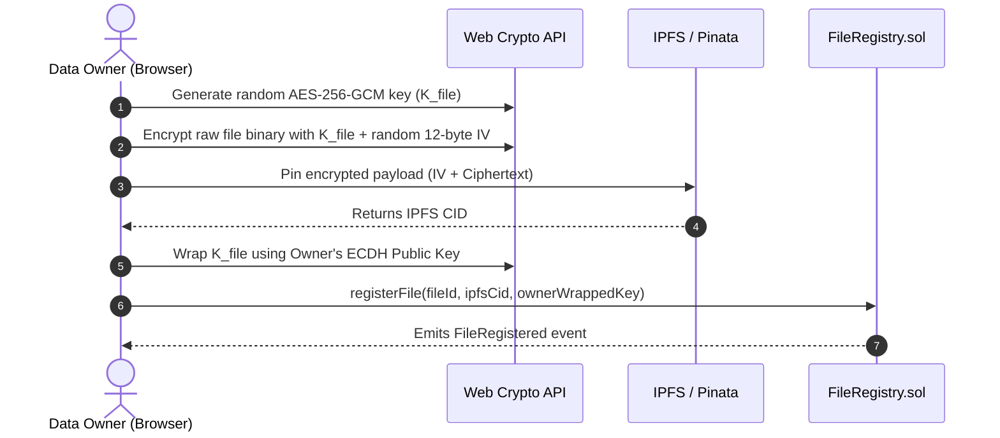
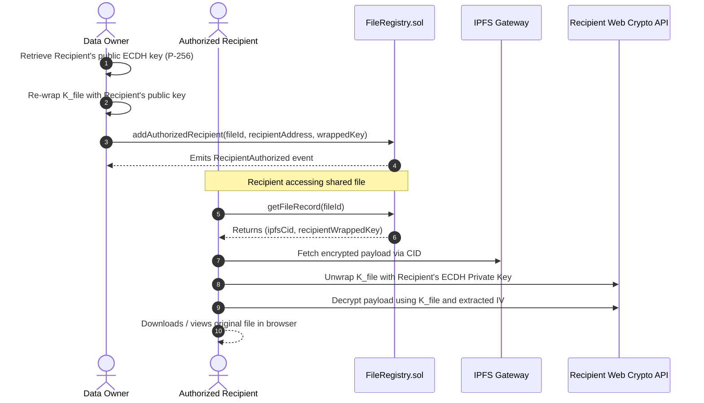

# BlockDrive 🛡️📦

> **Decentralized Access-Controlled File Sharing & On-Chain Certificate Verification System**  
> Combining client-side hybrid cryptography, IPFS distributed storage, and Ethereum smart contracts for non-repudiable access governance. Based on the cryptographic scheme proposed by Wang, Zhang & Zhang (*IEEE Access* 2018, [DOI: 10.1109/ACCESS.2018.2851611](https://doi.org/10.1109/ACCESS.2018.2851611)).

---

## 📑 Table of Contents
- [Overview](#-overview)
- [Key Features](#-key-features)
- [System Architecture](#-system-architecture)
  - [Upload & Encryption Flow](#1-upload--encryption-workflow)
  - [Access Sharing & Decryption Flow](#2-access-sharing--decryption-workflow)
  - [Document & Certificate Verification Flow](#3-document--certificate-verification-workflow)
- [Smart Contracts](#-smart-contracts)
- [Repository Structure](#-repository-structure)
- [Prerequisites](#-prerequisites)
- [Installation & Quick Start](#-installation--quick-start)
- [MetaMask Configuration & Development Tips](#-metamask-configuration--development-tips)
- [Testing & Quality Assurance](#-testing--quality-assurance)
- [Deployment to Public Testnets (Sepolia)](#-deployment-to-public-testnets-sepolia)
- [Environment Variables Reference](#-environment-variables-reference)
- [Security & Cryptographic Guarantees](#-security--cryptographic-guarantees)
- [License](#-license)

---

## 🌟 Overview

Traditional cloud storage platforms rely on centralized access control mechanisms and storage providers that hold plaintext user files or master decryption keys. This introduces significant risks of data breaches, unauthorized access, and single points of failure.

**BlockDrive** solves these challenges by combining:
1. **Client-Side Hybrid Cryptography**: Files are encrypted inside the user's browser using AES-256-GCM before transmission. Plaintext data never touches any server or peer-to-peer node.
2. **Decentralized IPFS Storage**: Encrypted payloads are pinned to IPFS (via Pinata Cloud or local IPFS daemons), addressed by immutable Content Identifiers (CIDs).
3. **On-Chain Access Governance**: Ethereum smart contracts manage access policies, recipient authorization, and encrypted key distribution without central intermediaries.
4. **Gas-Free Certificate Verification**: A dedicated on-chain document fingerprint registry allows institutions to issue tamper-proof certificates (degrees, credentials, contracts) and enables anyone to publicly verify authenticity with zero gas fees and zero wallet setup.

---

## 🚀 Key Features

- 🔐 **End-to-End Client Encryption**: 256-bit AES-GCM encryption with unique 96-bit initialization vectors (IVs) generated in-browser via the Web Crypto API.
- 🤝 **ECIES Key Encapsulation**: AES keys are wrapped per recipient using Elliptic Curve Diffie-Hellman (ECDH) on curve P-256 and stored on-chain.
- 📜 **On-Chain File Access Registry**: `FileRegistry.sol` verifies owner authorization, logs file creation events, and maintains active recipient whitelists.
- 🎓 **Independent Certificate Registry**: `CertificateRegistry.sol` allows designated issuers (`ISSUER_ROLE`) to stamp cryptographic fingerprints (Keccak-256) of certificates and credentials with instantaneous revocation controls.
- 🔍 **Public Read-Only Verification**: Anyone can upload a document or enter its hash to instantly verify its authenticity and issuance date without paying gas or connecting a Web3 wallet.
- ⚡ **Auto-Faucet for Localhost**: Built-in Hardhat JSON-RPC integration automatically funds new and connected accounts with 100 local test ETH, eliminating "insufficient funds" transaction failures.
- 🌐 **Modern React Frontend**: Clean, responsive dashboard built with React 18, Vite, Tailwind CSS, Lucide Icons, and Ethers.js v6.

---

## 🏛️ System Architecture

### 1. Upload & Encryption Workflow


### 2. Access Sharing & Decryption Workflow


### 3. Document & Certificate Verification Workflow

```mermaid
sequenceDiagram
    autonumber
    actor Issuer as Certified Authority (Issuer)
    actor Verifier as Public Verifier (Any User)
    participant Chain as CertificateRegistry.sol

    Note over Issuer, Chain: Phase 1: Issuance (Requires ISSUER_ROLE)
    Issuer->>Issuer: Compute Keccak-256 hash of document buffer
    Issuer->>Chain: issueCertificate(hash, recipientName, docType, metadataURI)
    Chain-->>Issuer: Emits CertificateIssued event

    Note over Verifier, Chain: Phase 2: Public Gas-Free Verification
    Verifier->>Verifier: Drag & drop certificate file into browser
    Verifier->>Verifier: Compute Keccak-256 hash client-side
    Verifier->>Chain: verifyCertificate(hash) [read-only call, 0 gas]
    Chain-->>Verifier: Returns (exists, revoked, issuer, recipientName, issueDate)
    Verifier-->>Verifier: Displays Verified Authenticity Badge
```


---

## 📜 Smart Contracts

All contracts are written in Solidity `^0.8.20` and utilize OpenZeppelin's audited libraries.

| Contract | Purpose | Key Functions / Events |
|---|---|---|
| **[`BlockDriveAccessControl.sol`](contracts/BlockDriveAccessControl.sol)** | Manages administrative roles, authorization bitmasks, and multi-attribute identity policies. | `hasRole`, `grantRole`, `hasRequiredAttributes`, `setUserAttributes` |
| **[`FileRegistry.sol`](contracts/FileRegistry.sol)** | Core file access governance layer mapping files to IPFS CIDs and per-recipient wrapped keys. | `registerFile`, `addAuthorizedRecipient`, `revokeRecipient`, `getFileRecord`, `isAuthorized` |
| **[`CertificateRegistry.sol`](contracts/CertificateRegistry.sol)** | Tamper-proof academic, diploma, and document credential verification registry with role governance. | `issueCertificate`, `revokeCertificate`, `verifyCertificate`, `getCertificate`, `ISSUER_ROLE` |

---

## 📁 Repository Structure

```text
Blockchain-main/
├── contracts/                        # Solidity smart contracts
│   ├── BlockDriveAccessControl.sol   # Role-based & attribute-based permissions
│   ├── FileRegistry.sol              # File metadata & encrypted key distribution
│   └── CertificateRegistry.sol       # Document fingerprinting & verification
├── frontend/                         # Vite + React Web Application
│   ├── public/                       # Static public assets
│   ├── src/
│   │   ├── components/               # Core UI components
│   │   │   ├── AuthModal.jsx         # Supabase authentication modal
│   │   │   ├── MyFiles.jsx           # File manager, recipient authorization & access revocation
│   │   │   ├── RequestAccessDecrypt.jsx # Manual decryption tool
│   │   │   ├── SharedFiles.jsx       # View and decrypt files shared with connected wallet
│   │   │   ├── UploadFile.jsx        # Client-side encryption & IPFS registration
│   │   │   └── WalletConnect.jsx     # Web3 wallet connection, balance badge & local faucet button
│   │   ├── features/
│   │   │   └── certificate-verification/ # Academic / document certificate module
│   │   │       ├── CertificateIssuer.jsx   # Role-gated issuance interface
│   │   │       ├── CertificateVerifier.jsx # Public zero-gas verification interface
│   │   │       └── certificateContracts.js # Contract ABIs & hashing helpers
│   │   ├── utils/
│   │   │   ├── contracts.js          # Contract connectors & ensureLocalFunds faucet helper
│   │   │   ├── crypto.js             # AES-256-GCM and ECDH P-256 cryptographic helpers
│   │   │   ├── deployedAddresses.json# Auto-generated contract deployment addresses
│   │   │   ├── ipfs.js               # Pinata Cloud IPFS upload & gateway downloader
│   │   │   └── supabaseClient.js     # Optional Supabase client configuration
│   │   ├── App.jsx                   # Main application layout, routing & tab state
│   │   ├── index.css                 # Tailwind CSS styles
│   │   └── main.jsx                  # React application entry point
│   ├── package.json                  # Frontend dependencies and scripts
│   └── vite.config.js                # Vite build configuration
├── scripts/                          # Hardhat deployment and utility scripts
│   ├── deploy.js                     # Deploys contracts and updates frontend address config
│   ├── fundAccount.js                # Helper script to send local test ETH to any address
│   └── grantIssuerRole.js            # Script to grant ISSUER_ROLE to target addresses
├── test/                             # Hardhat automated test suite
│   └── BlockDrive.test.js            # Comprehensive unit and integration tests (26 passing)
├── hardhat.config.js                 # Hardhat configuration (Solidity compiler, networks)
├── package.json                      # Root configuration and dependencies
└── README.md                         # Project documentation
```

---

## 🛠️ Prerequisites

Ensure you have the following installed on your machine:
- **Node.js**: `>= 18.0.0` (Recommended: Node 20 LTS or Node 22)
- **npm**: `>= 9.0.0` (bundled with Node.js)
- **MetaMask**: Browser extension for Chrome, Brave, Firefox, or Edge.

---

## ⚡ Installation & Quick Start

### Step 1: Clone and Install Dependencies
```bash
# 1. Clone the repository
git clone https://github.com/Anmol4679/blockchain_project_vit.git
cd blockchain_project_vit

# 2. Install root dependencies (Hardhat, Ethers, OpenZeppelin)
npm install

# 3. Install frontend dependencies (React, Vite, Tailwind CSS)
cd frontend
npm install
cd ..
```

---

### Step 2: Configure Environment Variables
Copy the example environment files:
```bash
# Root environment file (for testnet deployments)
cp .env.example .env

# Frontend environment file (for IPFS and contract addresses)
cp frontend/.env.example frontend/.env
```
*(For local development, the default values in `frontend/.env` are pre-configured to work out of the box).*

---

### Step 3: Run the Application (3 Easy Steps)

Open two terminal windows:

#### **Terminal 1: Start Local Hardhat Blockchain**
```bash
npx hardhat node
```
*This starts a local JSON-RPC Ethereum node on `http://127.0.0.1:8545` and generates 20 pre-funded test accounts (10,000 ETH each).*

#### **Terminal 2: Deploy Contracts & Launch Frontend**
```bash
# Deploy contracts to the local network
npm run deploy:local

# (Optional) Grant certificate issuer role to your testing wallet
npx hardhat run scripts/grantIssuerRole.js --network localhost

# Start the frontend dev server
cd frontend
npm run dev
```

The web application is now running at **[`http://localhost:5173/`](http://localhost:5173/)**!

---

## 🦊 MetaMask Configuration & Development Tips

### Adding the Hardhat Local Network to MetaMask
1. Open the **MetaMask** extension.
2. Click the network dropdown (top-left) and select **Add Network** > **Add a network manually**.
3. Fill in the network details:
   - **Network Name**: `Hardhat Localhost`
   - **New RPC URL**: `http://127.0.0.1:8545/`
   - **Chain ID**: `31337`
   - **Currency Symbol**: `ETH`
4. Click **Save** and switch to `Hardhat Localhost`.

### Importing a Pre-Funded Test Account
Hardhat Account #0 has 10,000 test ETH for local testing:
- **Address**: `0xf39Fd6e51aad88F6F4ce6aB8827279cffFb92266`
- **Private Key**: `0xac0974bec39a17e36ba4a6b4d238ff944bacb478cbed5efcae784d7bf4f2ff80`

In MetaMask: click **Account** > **Add Account or Hardware Wallet** > **Import Account** > paste the private key.

### Auto-Funding Any Connected Account
If you connect your personal account (or create a new account like `Anmol2`):
- The frontend features an **automatic local faucet** (`ensureLocalFunds`). Any connected wallet with less than 1.0 ETH is automatically given **100 test ETH** via Hardhat's native `hardhat_setBalance` RPC call.
- You can also click the **`+100 Test ETH`** button in the Web3 Wallet Interface card anytime.

### Important: How to Fix "Transaction Failed" or Nonce Desync in MetaMask
When you restart `npx hardhat node`, the blockchain resets to block #0. MetaMask may keep old cached transaction history and nonces, resulting in red "Transaction failed" notifications or nonce errors.
**To fix this instantly:**
1. Open MetaMask and navigate to **Settings** > **Advanced**.
2. Scroll down and click **Clear activity tab data** (or **Reset Account** in older versions).
3. This resets MetaMask's transaction history for localhost without deleting your keys or accounts.

---

## 🧪 Testing & Quality Assurance

BlockDrive includes a test suite covering contract deployment, access controls, encrypted file registration, authorization granting/revoking, and certificate issuance/revocation.

### Run Unit Tests
```bash
npx hardhat test
```
**Expected Output:**
```text
  BlockDrive Contracts
    AccessControl
      ✔ should set and verify user attributes
      ✔ should reject non-admin attribute update
    FileRegistry
      ✔ should register a file and emit FileRegistered event
      ✔ should reject duplicate file registration
      ✔ should allow authorized owner to retrieve file record and wrapped key
      ✔ should allow owner to add authorized recipient and emit RecipientAuthorized
      ✔ should reject unauthorized caller attempting to retrieve file record
      ✔ should reject non-owner attempting to add authorized recipient
      ✔ should allow owner to revoke recipient authorization
    CertificateRegistry
      ✔ should assign DEFAULT_ADMIN_ROLE and ISSUER_ROLE to deployer/admin
      ✔ should allow admin to grant and revoke ISSUER_ROLE
      ✔ should reject non-admin trying to grant ISSUER_ROLE
      ✔ should allow authorized issuer to issue certificate and emit CertificateIssued event
      ✔ should reject duplicate certificate hash registration
      ✔ should reject certificate issuance with empty hash, recipient, or documentType
      ✔ should reject non-issuer attempting to issue certificate
      ✔ should return valid verification details for an existing certificate
      ✔ should return exists=false for non-existent document hash
      ✔ should allow querying full certificate record via getCertificate
      ✔ should revert getCertificate for non-existent hash
      ✔ should allow the original issuer to revoke their certificate
      ✔ should allow DEFAULT_ADMIN_ROLE to revoke any certificate
      ✔ should reject revocation by an issuer who is not the original issuer nor admin
      ✔ should reject revocation by non-issuer account
      ✔ should reject revocation on already revoked certificate
      ✔ should reject revocation of non-existent certificate

  26 passing (6s)
```

### Run Code Coverage Report
```bash
npx hardhat coverage
```

---

## 🌐 Deployment to Public Testnets (Sepolia)

To deploy the contracts to the Ethereum Sepolia Testnet:

1. Obtain Sepolia test ETH from a faucet (e.g. [sepoliafaucet.com](https://sepoliafaucet.com) or [alchemy.com/faucets/ethereum-sepolia](https://www.alchemy.com/faucets/ethereum-sepolia)).
2. Add your credentials to the root `.env` file:
   ```ini
   SEPOLIA_RPC_URL=https://eth-sepolia.g.alchemy.com/v2/YOUR_ALCHEMY_API_KEY
   PRIVATE_KEY=0xYOUR_TESTNET_PRIVATE_KEY
   ETHERSCAN_API_KEY=YOUR_ETHERSCAN_API_KEY
   ```
3. Run the Sepolia deployment script:
   ```bash
   npm run deploy:sepolia
   ```
4. Update `frontend/.env` with the newly deployed contract addresses and set `VITE_RPC_URL` to your Sepolia RPC.

---

## 🔑 Environment Variables Reference

### Root Directory (`.env`)
| Variable | Description | Example |
|---|---|---|
| `SEPOLIA_RPC_URL` | Ethereum Sepolia JSON-RPC endpoint | `https://eth-sepolia.g.alchemy.com/v2/...` |
| `PRIVATE_KEY` | Deployer account private key (hex) | `0x123456789...` |
| `ETHERSCAN_API_KEY` | Etherscan API key for contract verification | `YOUR_ETHERSCAN_API_KEY` |

### Frontend Directory (`frontend/.env`)
| Variable | Description | Default / Example |
|---|---|---|
| `VITE_FILE_REGISTRY_ADDRESS` | Deployed address of `FileRegistry.sol` | `0xe7f1725E7734CE288F8367e1Bb143E90bb3F0512` |
| `VITE_ACCESS_CONTROL_ADDRESS` | Deployed address of `BlockDriveAccessControl.sol` | `0x5FbDB2315678afecb367f032d93F642f64180aa3` |
| `VITE_CERTIFICATE_REGISTRY_ADDRESS` | Deployed address of `CertificateRegistry.sol` | `0x9fE46736679d2D9a65F0992F2272dE9f3c7fa6e0` |
| `VITE_PINATA_API_KEY` | Pinata Cloud IPFS API Key | Pinata API Key |
| `VITE_PINATA_SECRET_API_KEY` | Pinata Cloud IPFS Secret Key | Pinata Secret Key |
| `VITE_PINATA_JWT` | Pinata Cloud JWT Token | Pinata JWT |
| `VITE_IPFS_GATEWAY` | Dedicated IPFS HTTP Gateway URL | `https://gateway.pinata.cloud/ipfs/` |
| `VITE_IPFS_API_URL` | Local IPFS Daemon API endpoint (optional) | `http://127.0.0.1:5001/api/v0` |
| `VITE_SUPABASE_URL` | Supabase project URL (optional user sessions) | `https://your-project.supabase.co` |
| `VITE_SUPABASE_ANON_KEY` | Supabase public anonymous API key | `eyJhbGci...` |

---

## 🔒 Security & Cryptographic Guarantees

1. **Zero Knowledge on Storage Layer**: IPFS only stores the ciphertext prefixed by its unique 12-byte initialization vector (IV). Even if an attacker acquires the IPFS CID, they cannot decrypt the file without the corresponding AES-256 key.
2. **Authenticated Encryption (AES-GCM)**: AES-256 in Galois/Counter Mode ensures both confidentiality and cryptographic integrity. Tampering with ciphertext in transit immediately causes decryption failure via auth-tag verification.
3. **No Private Key Transmission**: Private keys (both Ethereum secp256k1 keys and Web Crypto P-256 ECDH keys) never leave the user's browser.
4. **Smart Contract Role Separation**: OpenZeppelin's `AccessControl` restricts critical administrative functions (role granting, revocation) to designated accounts.

---

## 📄 License

This project is licensed under the [MIT License](LICENSE).
